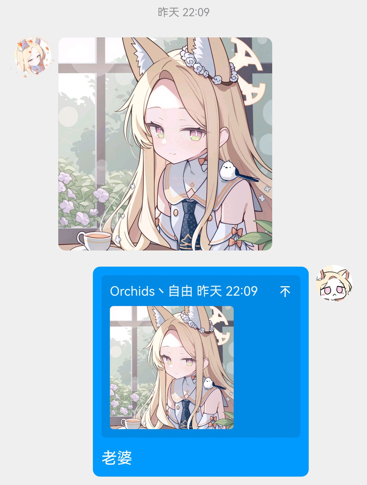
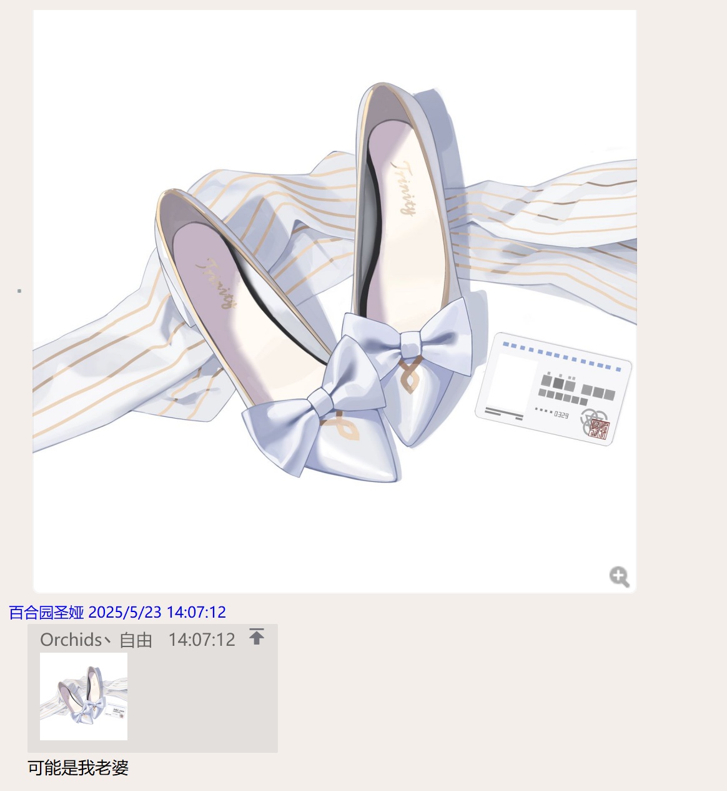
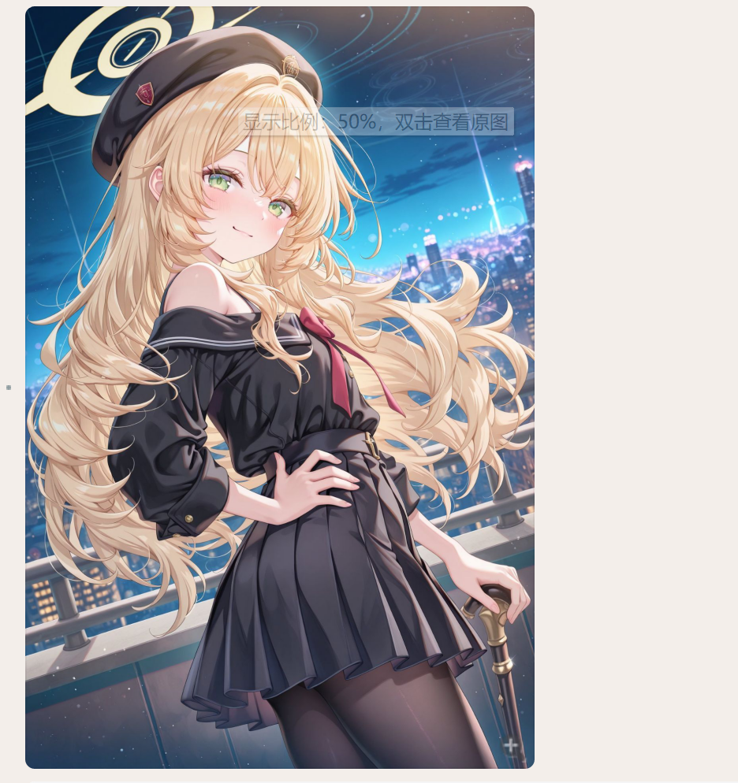

# Seia Detection Model

## 模型/代码来源

该模型基于[spawner1145](https://github.com/spawner1145)的仓库[NailongRecognizeRL](https://github.com/spawner1145/NailongRecognizeRL)训练而来，并根据 GNU Affero General Public License (AGPL) 版本 3 进行发布。

## 模型介绍
该模型基于预训练的ResNet-50模型，使用了我个人收集的200+张 **百合园圣娅** 的图片跟1k+张由我的QQbot接受到的各种图片训练而来，可以检测出包含seia的图。

因为该模型主要是为我的QQbot进行训练的,为了占用尽可能小的空间，我将训练好的.pth模型文件转换为ONNX格式，并使用ONNXRuntime库进行推理。

## 模型使用方法

2025/5/23更新：基于本仓库的模型编写的astrbot的插件：  
[astrbot_plugin_seiadetect](https://github.com/orchidsziyou/astrbot_plugin_seiadetect)

### 环境准备
参考requirements.txt安装所需的依赖库

### 训练模型
仓库已经提供了训练好的模型，如果需要重新训练模型，可以参考train01.py文件进行训练。

在我自己训练的时候，由于正数据相对于负数据集太少，因此在训练之前使用flip_picture.py把正训练集当中的所有图片进行上下翻转+左转来扩充数据集。

另外，由于数据集过大，而且可能包括一些别的照片，因此没有提供数据集，若想要自己训练，需要自己收集数据集。

### 预测
使用PredictONNX.py来预测图片是否包含seia。

### 注意事项
若不使用ONNXRuntime库进行推理，本仓库也提供了.pth模型文件，可以直接使用pytorch进行推理，推理代码参考run.py(代码来源@spawner1145)

## 存在问题
模型可能会把教授(ニヤニヤ教授)，玛丽等黄毛兽耳人物也检测为seia。

## 模型效果
由于篇幅问题，以下展示了我的bot应用中的效果：

（如果图片未显示，可能是路径问题，请检查图片路径）

未检测出seia的时候，没有回应.

